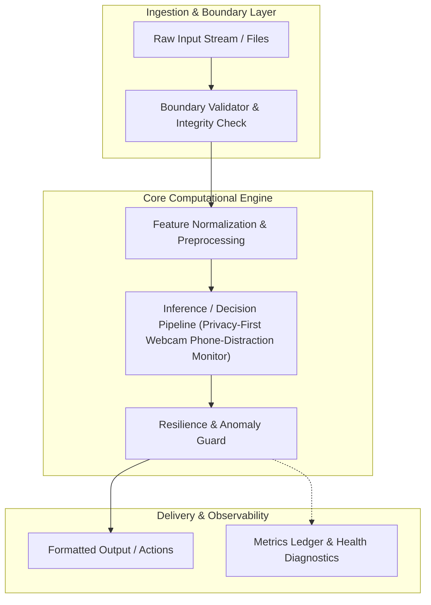
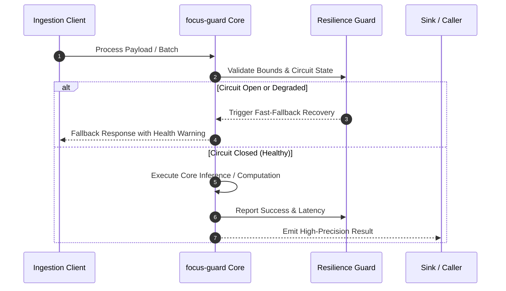
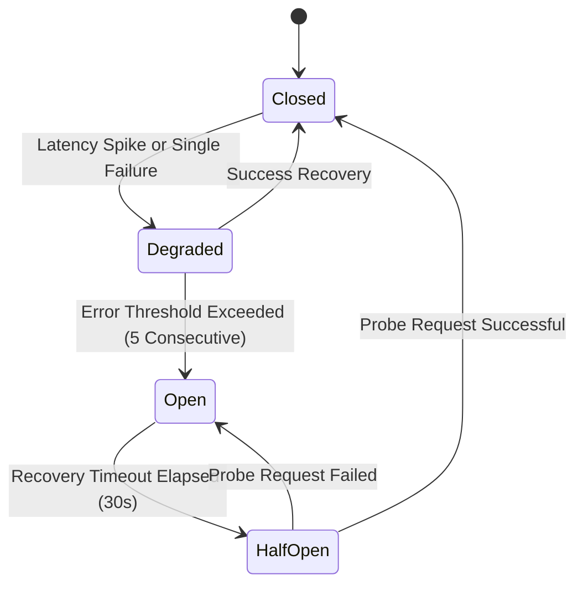

# focus-guard: System Architecture & Technical Topology

MediaPipe hand/face landmark distraction detector with local privacy guarantees, zero cloud uploads, and session telemetry.

## 1. System Topology & Pipeline Flow

## 2. Execution Sequence

## 3. Resilience Lifecycle State Machine

## 4. Architectural Design Principles
- **Predictable Latency**: All computational critical paths avoid unbounded loops or uncontrolled blocking IO.
- **Fail-Safe Degradation**: If underlying model components or system drivers encounter unexpected exceptions, the system transitions gracefully rather than causing process abortion.
